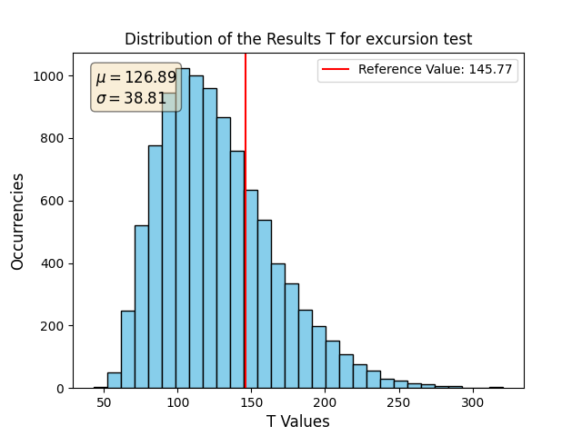
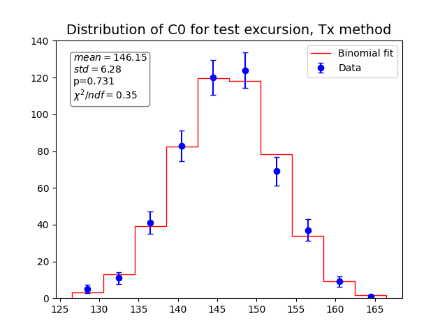
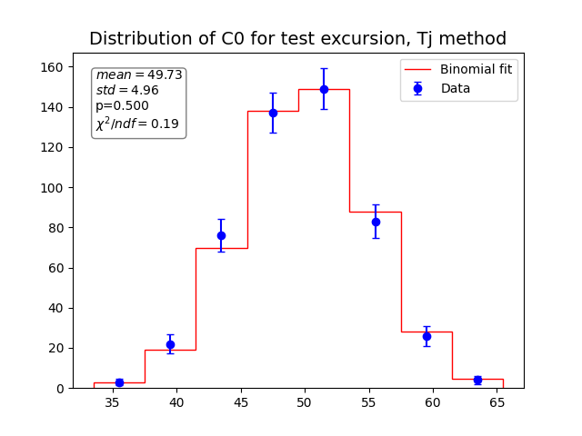
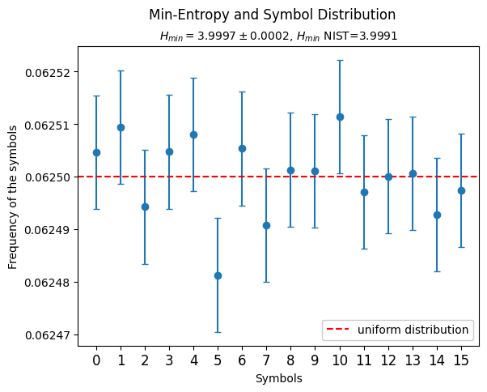

# Entropy validation


This project aims to provide a third entropy validation test suite, beyond the NIST randomness test suite [SP 800-22r1a](https://csrc.nist.gov/projects/random-bit-generation/documentation-and-software) and the [TestU01](https://simul.iro.umontreal.ca/testu01/tu01.html) suite.

This test suite, called IID_Validation (temporary name) implements three statistical measures to be computed over random bit sequences:

1. Testing of the IID Assumption (NIST [SP 800-90B](https://nvlpubs.nist.gov/nistpubs/SpecialPublications/NIST.SP.800-90B.pdf))
2. A RandomPower-specific statistical analysis suite (TODO: fill in)
3. Calculation of the [Min-Entropy](https://en.wikipedia.org/wiki/Min-entropy)

The IID Assumption is evaluated according to the Permutation Testing section of chapter 5 in NIST [SP 800-90B](https://nvlpubs.nist.gov/nistpubs/SpecialPublications/NIST.SP.800-90B.pdf). The procedure checks whether the input sequence has an internal structure that would skew the results of the IID test suite. To do so it compares the outcomes of the selected tests for the input sequence, here called Tx, with those obtained using n_permutations shuffled versions of the latter, which are named Ti. For each selected test, an histogram of the obtained Ti is produced, with the Tx reference value shown as a red line. Fig1 shows an exemplary plot for the excursion test with n_symbols = 1000 and n_permutations = 10000. If the symbols that make up the input sequence are IID, Tx shouldn't be an extreme value of the Ti distribution and should instead fall within the central 99.5% of the sample. A counter C0 is updated every time that a result Ti is smaller than the reference values Tx and a counter C1 is increased when they are equal.

    <figcaption>Fig1: Histogram of the results Ti for the excursion test with parameters n_symbols=1000 and n_permutations=10000.</figcaption>
</figure>
The statistical analysis suite performs a statistical analysis on the counters C0, which are expected to be binomially distributed for each of the given tests. The sample is plotted against the theoretical binomial distribution in an histogram. The box reports the mean and standard deviation of the sample, the parameter p of the binomial distribution (i.e. the probability for the counter to update at the next Ti) and the reduced chi square for the data in the null hypotesis of binomial distribution. Fig2 shows an exemplary plot for the excursion test for n_symbols = 1000, n_permutations = 200 and n_iterations = 500.
<figure>
    
    <figcaption>Fig2: Distribution of the counters C0 computed keeping as reference the Tx result for the excursion test with parameters n_symbols = 1000, n_permutations = 200, n_iterations = 500.</figcaption>
</figure>
The statistical analysis on the counter C0 is also carried out with the "Tj method", that is by considering consecutive pairs of Ti and increasing C0 whenever the first one is greater than the second one. If the Ti are equal the couple is discarded in order to recover a binomial parameter of p = 0.5. The results are plotted as previously. Fig3 shows an exemplary plot for the excursion test with the same parameters used above. Please note that despite the probability for the counter to increase being p = 0.5, the mean of the distribution is approximately equal to the number of Ti / 4 (aka n_permutations / 4) because this method effectively halves the number of occasions for the C0 to update, compared to the previous "Tx method".
<figure>
    
    <figcaption>Fig3: Distribution of the counters C0 computed confronting pairs of Ti results for the excursion test with parameters n_symbols = 1000, n_permutations = 200, n_iterations = 500.</figcaption>
</figure>
The min-entropy is evaluated over the whole file as H<sub>min</sub> = -log<sub>2</sub> (p<sub>max</sub>), p<sub>max</sub> being the frequency of the symbols that is the most likely to occur, and given an error with the propagation of the binomial uncertainty on p<sub>max</sub>. The NIST definition of min-entropy, which considers a lower bound on p<sub>max</sub>, is calculated as well. The distribution of the symbols that make up the file under test is shown in a scatter plot with binomial error bars and compared with the uniform distribution. Fig4 shows the plot for an exemplary 250MB file.
<figure>
    
    <figcaption>Fig4: Frequencies of the symbols in a 250MB file.
</figure>

## The IID_validation test suite

The suite is implemented in Python 3 as the `main_parallelized.y` Python program:

```
$ main_parallelized.py --help
```

TODO: fill this section

## Installing the software

The software is distributed with a list of requirements contained in `requirements.txt`. It is recommended to install the dependencies and run the software inside a Python virtual environment.

For example, using `venv`:

```shell
$ python3 -m venv .venv
$ source .venv/bin/activate
(.venv) $ pip install -r requirements.txt
(.venv) $ python main_parallelized.py --help
```

The main dependencies of the IID_Validation test suite are `numpy`, `matplotlib` and the `tqdm` utility library.

## NIST IID test suite indexes

The following is the list of test indexes used in the software, specifically for the **NIST IID test suite**. On the left, there are the indexes used in the program, while, on the right, the associated references.

| Index | NIST SP 800-90B reference                      |
|:-----:|:-----------------------------------------------|
|  0    | **5.1.1** - Excursion Test Statistic           |
|  1    | **5.1.2** - Number of Directional Runs         |
|  2    | **5.1.3** - Length of Directional Runs         |
|  3    | **5.1.4** - Number of Increases and Decreases  |
|  4    | **5.1.5** - Number of Runs Based on the Median |
|  5    | **5.1.6** - Length of Runs Based on Median     |
|  6    | **5.1.7** - Average Collision Test Statistic   |
|  7    | **5.1.8** - Maximum Collision Test Statistic   |
|  8    | **5.1.9** - Periodicity Test Statistic         |
|  9    | **5.1.10** - Covariance Test Statistic         |
| 10    | **5.1.11** - Compression Test Statistic        |

For more, refer to the **NIST SP 800-90B Recommendation**.
