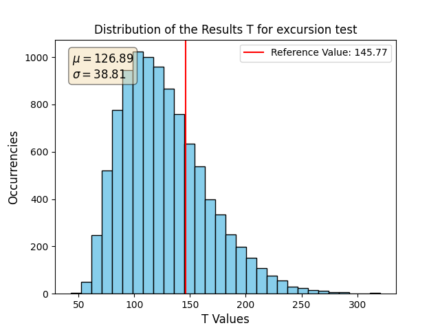
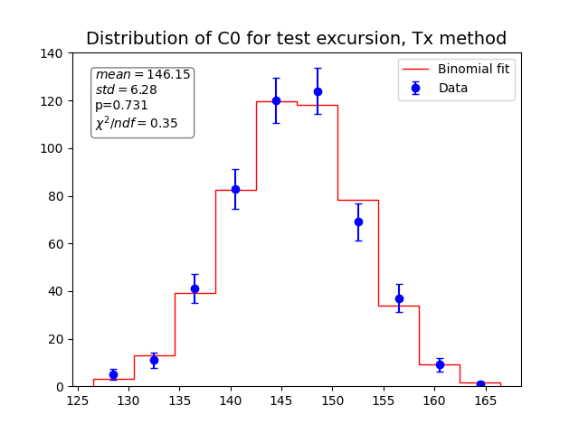
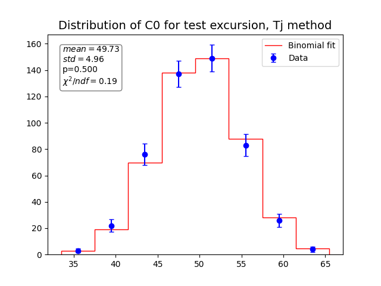
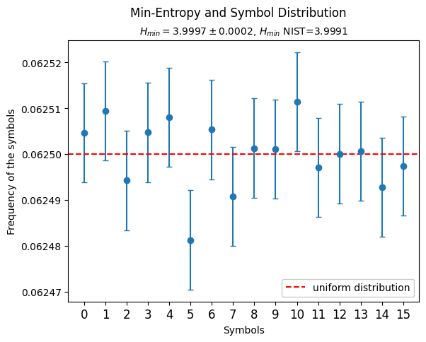

# Entropy validation


This project aims to provide a third randomness test suite, beyond the NIST randomness test suite [SP 800-22r1a](https://csrc.nist.gov/projects/random-bit-generation/documentation-and-software) and the [TestU01](https://simul.iro.umontreal.ca/testu01/tu01.html) suite.

#### Table of contents

- [The IID_Validation test suite](#the-iid_validation-test-suite)
  - [NIST IID testing](#nist-iid-testing)
  - [Statistical analysis](#statistical-analysis)
  - [Min-entropy calculation](#min-entropy-calculation)
- [Installing the software](#installing-the-software)
  - [Setting up a local development environment](#setting-up-a-local-development-environment)
- [Using the software](#using-the-software)
- [Software configuration](#software-configuration)
  - [Global options](#global-options)
  - [NIST test options](#nist-test-options)
  - [Statistical analysis options](#statistical-analysis-options)
  - [NIST IID test suite indexes](#nist-iid-test-suite-indexes)

## The IID_validation test suite

This test suite, called `IID_Validation`, implements three statistical measurements to be computed over random bit sequences.

### NIST IID testing

The IID validation procedure performs the eleven statistical tests detailed in the Permutation Testing section of Chapter 5 of [NIST SP 800-90B](https://nvlpubs.nist.gov/nistpubs/SpecialPublications/NIST.SP.800-90B.pdf) over a reference sequence of `n_symbols` symbols taken from the file under test.
The reference results (here called `Tx`) are compared to the results (here called `Ti`) of the same tests executed over `n_permutations` sequences obtained by shuffling the reference sequence.

For each test, each element of `Ti` is compared to the reference `Tx`: if it is smaller, a counter `C0` is incremented; if it is equal, a counter `C1` is incremented.
The symbols in the sequence are validated as IID if, for every test, the reference value `Tx` does not lie in the upper or lower 0.05% of the total population of `Ti` - in other words, if `C0` >= 0.0005 * `n_permutations` and `C1` + `C0` <= 0.9995 * `n_permutations`.

To visualize the results, the population of `Ti` is shown as a histogram, with the reference value `Tx` marked by a red line.
[Fig. 1](#fig-histTxTi) shows an example plot for the excursion test with `n_symbols` = 1000 (10^3) and `n_permutations` = 10000 (10^4).

<figure id=fig-histTxTi>

    <figcaption>Figure 1: Histogram of the results Ti for the excursion test with parameters n_symbols=1000 and n_permutations=10000.</figcaption>
</figure>

The parameter values specified by NIST are `n_symbols` = 1000000 (10^6) and `n_permutations` = 10000 (10^4).

### Statistical analysis

The tests of the Permutation Testing procedure described by NIST, albeit concise and simple, do not give us easily interpretable information about the theoretical distribution of their outcomes.

Shuffling the input sequence to obtain a `Ti` is tantamount to picking a random value from the distribution shown in the histogram in [Fig. 1](#fig-histTxTi).
The value of the counter `C0` can therefore be interpreted as the number of "successes" over `n_permutations` trials (with "success" defined as a property of the element of `Ti`, such as it being smaller than the reference value `Tx`), and is therefore expected to be binomially distributed.

To perform a critical statistical analysis of this binomial characteristic, a sample of `n_iterations` counters C0 is computed for each test. The analysis is performed with two different methods, described below.

The default parameters are `n_symbols` = 1000, chosen so that the space of the possible results `Ti` is wide enough, `n_permutations` = 200 and `n_iterations` = 500, high enough for the statistical interpretation to be meaningful.

#### Tx method

The counter `C0` is updated whenever `Ti` is bigger than the reference `Tx`, so the parameter `p` of the theoretical binomial distribution for `C0` representing the probability of "success" is equal to the fraction of population to the left of the reference in the histogram of `Ti`.
A number `n_iterations` of counters `C0` is produced and their values are plotted with binomial error bars alongside the expected binomial distribution in red.
[Fig. 2](#fig-countersTx) shows an example plot for the excursion test for `n_symbols` = 1000, `n_permutations` = 200 and `n_iterations` = 500.
The box reports the mean and standard deviation of the sample, the parameter `p`, and the reduced chi square for the data in the null hypothesis of binomial distribution.

<figure id=fig-countersTx>
    
    <figcaption>Figure 2: Distribution of the counters C0 computed keeping as reference the Tx result for the excursion test with parameters n_symbols = 1000, n_permutations = 200, n_iterations = 500.</figcaption>
</figure>

#### Tj method

In order to have a predictable and uniform value for `p` throughout the tests and the tested files, a second criterion for the increase of C0 is considered that does not depend on the random value `Tx`.
Instead of having a fixed reference, the `Ti` results for each test are considered in non-overlapping consecutive pairs: the counter C0 is increased whenever the first element in the pair is greater than the second.
If the two elements are equal, the pair is discarded and re-computed, so that the results are normalized and the probability for the counter `C0` to increase is `p` = 0.5 in each iteration.
[Fig. 3](#fig-countersTj) shows an example plot for the excursion test with parameters `n_symbols` = 1000, `n_permutations` = 200 and `n_iterations` = 500.
Please note that despite the probability of increasing the counter equal to p = 0.5, the mean of the distribution is approximately equal to  `n_permutations` / 4, because this method effectively halves the number of occasions for `C0` to update, compared to the previous "Tx method".

<figure id=fig-countersTj>
    
    <figcaption>Figure 3: Distribution of the counters C0 computed confronting pairs of Ti results for the excursion test with parameters n_symbols = 1000, n_permutations = 200, n_iterations = 500.</figcaption>
</figure>

### Min-entropy calculation

The min-entropy is calculated over the whole file as $H_{min} = -log_2(p_{max})$, with $p_{max}$ being the frequency of the symbol that is the most likely to occur, and given an error with the propagation of the binomial uncertainty on $p_{max}$.
The min-entropy is also calculated according to the NIST definition, which considers a lower bound on $p_{max}$ without a separate error indication.
The distribution of the symbols that make up the file under test is shown in a scatter plot with binomial error bars and compared with the uniform distribution.

[Fig. 4](#fig-min-entropy) shows the plot for an example 250MB file.

<figure id=fig-min-entropy>
    
    <figcaption>Figure 4: Frequencies of the symbols in a 250MB file.
</figure>

## Installing the software

The software is packaged using [setuptools](https://pypi.org/project/setuptools/) and can be installed as a regular Python package from this repository.
It requires Python >= 3.11.

To access this repository on a deployment machine, use a [Deploy Key](https://docs.github.com/en/authentication/connecting-to-github-with-ssh/managing-deploy-keys#deploy-keys).

Once you can access this repository from the deployment server, you can install the software in a managed virtual environment by using [pipx](https://pypi.org/project/pipx/). Pipx will automatically take care of creating a managed virtual environment, installing the dependencies there, and adding a script to the `$PATH` that activates the virtual environment and runs the software transparently.

For example, to install the latest released version of the software specifying Python version 3.11:

```shell
$ pip install --user pipx
$ pipx install --python python3.11 git+ssh://git@github.com/RandomPower/IID_validation.git@latest
$ pipx list
...
   package iid-validation 1.0.0, installed using Python 3.11.7
    - iid_validation
$ iid_validation --help
```

The dependencies of the software are `numpy`, `matplotlib` and the `tqdm` utility library.

### Setting up a local development environment

A local development environment for the software can be set up by cloning this repository, and preparing a self-managed virtual environment to handle dependencies.

The software is distributed with a frozen list of requirements contained in `requirements.txt`, which you can use to set up your development virtual environment.

For example, using the `venv` Python module:

```shell
$ python3 -m venv .venv
$ source .venv/bin/activate
(.venv) $ pip install -r requirements.txt
(.venv) $ pip install .
```

Once you have set up and activated the virtual environment, you can run the software under development, without installing it, by running the `iid_validation` Python module or the `main.py` helper script provided in the repo:

```shell
(.venv) $ python main.py --help
(.venv) $ python -m iid_validation --help
```

> **N.B.**: Make sure your Python interpreter points to a version >= 11. Otherwise, invoke it explicitly (e.g., `python3.11` instead of `python3` or `python`).

## Using the software

The software is distributed as the `iid_validation` Python module.

It provides a set of libraries implementing the test suite components, and an executable script which the user can run on the command line.
If you have [installed the software](#installing-the-software), this script is available on the `$PATH`:

```
$ iid_validation --help
```

## Software configuration

Program options can be set in a TOML configuration file, or on the command line.
The software contains default values for all parameters except the input file to test: values specified in the configuration file have precedence over the defaults, and values specified on the command line have precedence over any others.

A concise description of the options is available by running the program with the `--help` option; a full description is found in the following subsections.

Program options are divided into three groups: global, NIST test and Statistical analysis.

### Global options

These options configure the overall operation of the software. They can be specified in the configuration file (see `-c, --config` option) in the `[global]` section.

- `-c CONFIG`, `--config CONFIG` \
    The configuration file, in TOML format.

    It can be specified as an absolute or relative path. If relative, it will be interpreted as relative to the current directory.
    If not specified, the program will look for a file named `conf.toml` in the current directory.

    A configuration file can contain no, some, or all possible parameters.
    You can find a [reference configuration file](conf.toml) in the repo.

    **Note**: this option cannot be specified in the config file.

- `-i INPUT_FILE`, `--input_file INPUT_FILE` \
    The binary input file containing the random bits to analyze.

    It can be specified as an absolute or relative path. If relative, it will be interpreted as relative to the current directory.
    The accepted file extensions are `.bin` and `.dat` (case-insensitive).

- `-t`, `--nist_test`, `--no-nist_test` \
    Enables the NIST IID validation process on the input file.

    Active by default.

- `-a`, `--stat_analysis`, `--no-stat_analysis` \
    Enables the Random Power statistical analysis on the input file.

    Enabled by default.

- `-e`, `--min_entropy`, `--no-min_entropy` \
    Enables the min-entropy calculation on the input file.

    Enabled by default.

- `--parallel`, `--no-parallel` \
    Run the NIST permutation tests in parallel, using multiprocessing.

    The number of parallel processes corresponds to the number of CPUs available on the system.

    Enabled by default.

- `-d`, `--debug` \
    Show debug messages on the command line.

    Debug messages are always saved in the application log file saved in each result folder.

    False by default.

### NIST test options

These options configure the [NIST permutation tests](#nist-iid-testing). They can be specified in the configuration file (see `-c, --config` option) in the `[nist_test]` section.

- `--nist_selected_tests INDEX [INDEX ...]` \
    The permutation tests to execute for the IID validation process. Supported values are described in [NIST IID test suite indexes](#nist-iid-test-suite-indexes).

    All tests are enabled by default.

- `--nist_n_symbols NIST_N_SYMBOLS` \
    The number of symbols to analyze.

    The NIST tests require a minimum number of symbols greater than the alphabet size (number of possible symbol values).
    Since our application only supports 4-bit symbols (for now), the corresponding alphabet size is 2^4 = 16.

    This number cannot be more than the number of symbols contained in the input file. Since our application only supports 4-bit symbols (for now), the number of symbols in the input file is double the number of bytes in the file.

    Set to 1000000 (10^6) by default.

- `--nist_n_permutations NIST_N_PERMUTATIONS` \
    The number of Fisher-Yates permutations to generate from the input sequence.

    Set to 10000 (10^4) by default.

- `--first_seq` \
    Test the first symbol sequence from the input file. Mutually exclusive with `--last_seq`.

    Enabled by default.

- `--last_seq` \
    Test the last symbol sequence from the input file. Mutually exclusive with `--first_seq`.

    Disabled by default.

- `--plot`, `--no-plot` \
    Enables the generation of a histogram plot for each of the executed tests.

    Enabled by default.

- `--nist_p P [P ...]` \
    The lag parameters p used for the periodicity and covariance tests.

    Each p value has to be included in the open interval (0, nist_n_symbols).

    Set to the NIST SP-800-90B values [1, 2, 8, 16, 32] by default.

### Statistical Analysis options

These options configure the Random Power [statistical analysis](#statistical-analysis).

- `--stat_selected_tests INDEX [INDEX ...]` \
    The permutation tests to execute for the Random Power statistical analysis. Supported values are described in [NIST IID test suite indexes](#nist-iid-test-suite-indexes).

    All tests are enabled by default.

- `--stat_n_symbols STAT_N_SYMBOLS` \
    The number of symbols to analyze.

    The NIST tests require a minimum number of symbols greater than the alphabet size (number of possible symbol values).
    Since our application only supports 4-bit symbols (for now), the corresponding alphabet size is 2^4 = 16.

    This number cannot be more than the number of symbols contained in the input file. Since our application only supports 4-bit symbols (for now), the number of symbols in the input file is double the number of bytes in the file.

    Set to 1000 (10^3) by default.

- `--stat_n_permutations STAT_N_PERMUTATIONS`  \
    The number of Fisher-Yates permutations to generate from the input sequence.

    Set to 200 by default.

- `--stat_n_iterations STAT_N_ITERATIONS` \
    The number of iterations of the IID test suite to obtain the statistical distribution of counter C0.

    Set to 500 by default.

- `--stat_p P` \
    The lag parameter p used for the periodicity and covariance tests.

    Only one value of p is used in the Random Power statistical analysis, in contrast with the generic NIST test suite.
    The value has to be included in the open interval (0, nist_n_symbols).

    Set to 2 by default.

### NIST IID test suite indexes

Our implementation of the NIST IID test suite uses the following indexes to refer to the permutation tests:

| Index | NIST SP 800-90B reference                      |
|:-----:|:-----------------------------------------------|
|  0    | **5.1.1** - Excursion Test Statistic           |
|  1    | **5.1.2** - Number of Directional Runs         |
|  2    | **5.1.3** - Length of Directional Runs         |
|  3    | **5.1.4** - Number of Increases and Decreases  |
|  4    | **5.1.5** - Number of Runs Based on the Median |
|  5    | **5.1.6** - Length of Runs Based on Median     |
|  6    | **5.1.7** - Average Collision Test Statistic   |
|  7    | **5.1.8** - Maximum Collision Test Statistic   |
|  8    | **5.1.9** - Periodicity Test Statistic         |
|  9    | **5.1.10** - Covariance Test Statistic         |
| 10    | **5.1.11** - Compression Test Statistic        |

For more information on the individual tests, refer to [NIST SP 800-90B](https://csrc.nist.gov/pubs/sp/800/90/b/final).